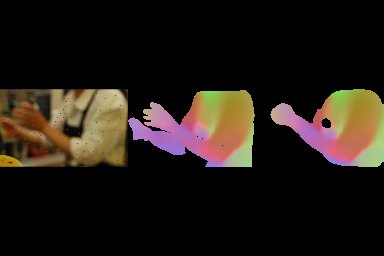

# Correspondence Embedding Predictor Using Dense 2D-3D Data

<span style="font-size:20px;">[Under Review at IEEE TCSVT]</span>

   

This repository contains the training data for a dense correspondence embedding predictor. In this codebase, we employ datasets with **ground truth annotations**, such as DensePose-COCO, and present an alternative approach for training dense correspondence embeddings based on ground truth 2D-3D annotations. You may train this predictor using either the implementation provided in this repository, or the one from the codebase of **Structured Distilled 3D Gait Fields (SD-3DGF)**.

<p align="center">
  
</p>

## 1. News

- [x] Provide all required training data
- [x] Release Pytorch Implementation Code
- [x] Release Visualization Code
- [ ] Code cleanup and improvements based on feedback
## 1. Features

#### Supported CNN backbones
- `effunet`: EfficientUNet
- `unet`: UNet (Standard Version)
- `darknet`: DarkNet-v2
#### Supported ViT backbones
- `dinov2`: DINOv2
- `clip`:  CLIP (ViT Image Encoder)

## 2. Data Preparation
#### First Clone the repository
```bash
git clone https://github.com/YubinWang2021/DCEPredictor
```
#### 2.1 Download the DensePose-COCO datasets 
Download raw images of COCO 2014: [this link](https://cocodataset.org/#download)

Download the ground-truth dense 2D-3D annotations: the dataset splits used in the training schedules are
`train2014`, `valminusminival2014` and `minival2014`.
`train2014` and `valminusminival2014` are used for training,
and `minival2014` is used for validation.

<table><tbody>
<!-- START TABLE -->
<!-- TABLE HEADER -->
<th valign="bottom">Name</th>
<th valign="bottom"># inst</th>
<th valign="bottom"># images</th>
<th valign="bottom">file size</th>
<th valign="bottom">download</th>
<!-- TABLE BODY -->
<!-- ROW: densepose_train2014 -->
<tr><td align="left">densepose_train2014</td>
<td align="center">39210</td>
<td align="center">26437</td>
<td valign="center">526M</td>
<td align="left"><a href="https://dl.fbaipublicfiles.com/densepose/annotations/coco/densepose_train2014.json">densepose_train2014.json</a></td>
</tr>
<!-- ROW: densepose_valminusminival2014 -->
<tr><td align="left">densepose_valminusminival2014</td>
<td align="center">7297</td>
<td align="center">5984</td>
<td valign="center">105M</td>
<td align="left"><a href="https://dl.fbaipublicfiles.com/densepose/annotations/coco/densepose_valminusminival2014.json">densepose_valminusminival2014.json</a></td>
</tr>
<!-- ROW: densepose_minival2014 -->
<tr><td align="left">densepose_minival2014</td>
<td align="center">2243</td>
<td align="center">1508</td>
<td valign="center">31M</td>
<td align="left"><a href="https://dl.fbaipublicfiles.com/densepose/annotations/coco/densepose_minival2014.json">densepose_minival2014.json</a></td>
</tr>
</tbody></table>


#### 2.2 Download files related to the SMPL model surface Modeling.

(1) Geodists_smpl_27554.pkl: [this link](https://drive.google.com/file/d/1RYha1f6jaT0hC1Gkm4tbmLbi86aSEDva/view?usp=sharing)

(2) Pdist_matrix.mat: [this link](https://drive.google.com/file/d/11mM4lBXGXoJnfM1U8ZZEc-sDw_b1w3Ul/view?usp=sharing)

(3) SMPL_subdiv.mat: [this link](https://drive.google.com/file/d/1fdNBrvK157GIIwKMdqIllSRvUOcU_goz/view?usp=sharing)

(4) SMPL_SUBDIV_TRANSFORM.mat: [this link](https://drive.google.com/file/d/1Vjrd_NFytBGTlyacnms9jR4QIlA19QwY/view?usp=sharing)

(5) UV_Processed.mat: [this link](https://drive.google.com/file/d/1U6N8tb14RmZNNzjsEvMFHdWphpMqy_h_/view?usp=sharing)

For Visualization Code (Not required during the training stage):  
You may also need to download the officially provided SMPL model files at: https://smpl.is.tue.mpg.de/ such as:

smpl_mean_params.npz or smpl_mean_params.h5
J_regressor_h36m.npy
J_regressor_extra.npy
basicModel_neutral_lbs_10_207_0_v1.0.0.pkl

Unfortunately, we do not have the permission to directly share these official files above. Therefore, you must download the SMPL model from the official website.

#### 2.3 Please prepare the dataset according to the following format (for training).
```text
data/
├── annotations/
├── densepose_coco_2014_minival.json
├── densepose_coco_2014_train.json
├── densepose_coco_2014_valminusminival.json
├── geodists_smpl_27554.pkl
├── Pdist_matrix.mat
├── SMPL_subdiv.mat
├── SMPL_SUBDIV_TRANSFORM.mat
├── UV_Processed.mat
├── train2014/
└── val2014/
```

## 3. Environment Setup and Dependency Installation

First, create a virtual environment for the repository
```bash
conda create -n dcepredictor python=3.10
```
then activate the environment 
```bash
conda activate dcepredictor
```
Next, install the package by running
```bash
python setup.py install
```
Then, install the dependencies
```bash
pip install -r requirements.txt
```

## 4. Training and Testing Scripts

For training, please run:
```bash
python -m trainer.dce_trainer
```
For test, please run:
```bash
python -m evaluater.dce_evaluater
```

## 5. Visualization

(1) During training, the visualization results of the dense correspondence embedding will be saved to embed_True.png. Two visualization methods are available: PCA dimensionality reduction and extracting the first three dimensions of the embedding for visualization (embed[:, :, :3]). You can modify them in the corresponding code section as needed.

(2) For 3D visualization code, run:
```bash
python visualize_dce_3D.py
```

Please download some official SMPL model data and the files required for loading the SMPL model from the official website: https://smpl.is.tue.mpg.de/, and put them in the data folder.

** If this work is published, we will organize the dense correspondence embedding visualization and different kinds of 3D visualizations and release them in a separate repository at https://github.com/YubinWang2021/Demo-3D-Vis-Code **

## Citation

The paper is under review at IEEE TCSVT.
- Note
  - All pedestrian video/image data are for research purposes only and must comply with the usage policies of the corresponding open-source datasets.
  
## Acknowledgement
Related Repositories:
-  [CAL](https://github.com/guxinqian/Simple-CCReID). 
-  [VCCReID-Baseline](https://github.com/dustin-nguyen-qil/VCCReID-Baseline). 


